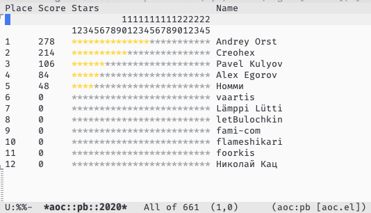

- [**aoc.el** &#x2014; Advent of Code private leaderboard client](#orga7fcdaf)
- [Installation](#orgb7ac561)
  - [Via `use-package`](#org97d2e3d)
- [Keys in private leaderboard table](#org325c794)
- [Customization](#orge480bce)
- [License](#org2dcb75d)


<a id="orga7fcdaf"></a>

# **aoc.el** &#x2014; Advent of Code private leaderboard client





<a id="orgb7ac561"></a>

# Installation


<a id="org97d2e3d"></a>

## Via `use-package`

```elisp
(use-package aoc
  :ensure nil
  :quelpa
  (aoc :repo "pkulev/aoc.el"
       :fetcher github :upgrade t)
  :custom
  (aoc-private-leaderboard-ids '("<LEADERBOARD-ID>") "Get this from leaderboard URL.")
  (aoc-user-session-id "<SESSION-ID>" "Get this from request cookies in browser."))
```


<a id="org325c794"></a>

# Keys in private leaderboard table

| Key | Description                       |
| --- | --------------------------------- |
| g   | Refresh this table.               |
| f   | Show table for the next year.     |
| b   | Show table for the previous year. |
| q   | Bury table buffer.                |


<a id="orge480bce"></a>

# Customization

Customizable variables are subject for change so, **TODO TBA** here.

-   **`aoc-user-session-id`:** *Session ID.*
    
    Session ID that appears in cookies after authentication on <https://adventofcode.com>.

-   **`aoc-private-leaderboard-ids`:** *List of IDs for leaderboards.*
    
    List of Leaderboard IDs to choose from when activating the mode.

-   **`aoc-private-leaderboard-url`:** *Private leaderboard URL template.*
    
    You probably should not touch it.

-   **`aoc-private-leaderboard-year`:** *Year for leaderboard.*
    
    Local buffer variable. Default value is current year.

-   **`aoc-private-request-interval`:** *Request interval (author asks to keep 15min interval).*
    
    Will be used for updates by timer and tracking manual updates (TODO caching).


<a id="org2dcb75d"></a>

# License

This package is distributed under the GNU General Public License, version 3 or later. See the file LICENSE for details.